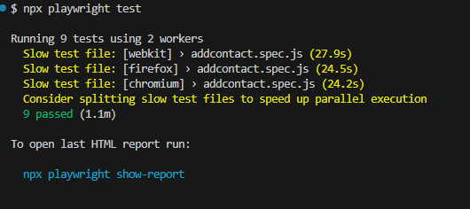

# Contact List Manager App Automation with Playwright JavaScript
In this project, automation of different components of the contact list manager app is implemented with Playwright in JavaScript.

### Components
- Login Page
- Signup Page
- Add Contact Page

## Playwright-Automation
Playwright is a framework for Web Testing and Automation. It is built to enable cross-browser web automation that is reliable and fast. Playwright, also has its own test runner for end-to-end tests called Playwright Test.

## Prerequisites:
1. Download and install Node.js
2. Download and install any Text Editor like Visual Code/Sublime/Brackets

## Setup and Installation:
- Clone the project
- Run ```bash npm i``` to install all the dependencies

## Tests Execution:
- Run ```bash npx playwright test ```to execute the tests
- Run ```bash npx playwright test login_page.spec.js ```to execute a single test
- Run ```bash npx playwright test login_page.spec.js --project=chromium --headed ```to execute on chrome

## Documentation and Testcases
Documentation file can be found in Doc folder and Testcases file can be seen in main directory 

## Test Results

